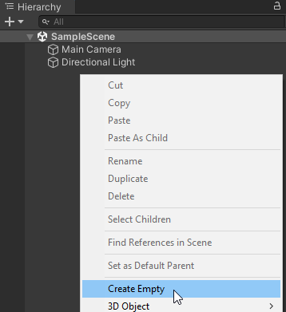

# Simple Saving

## Step 1 - Install
To install Prowlynx Save Manager you need to import it from the Asset Store after purchasing. Follow the same process you use for all your Asset Store purchases.

On import please do not interrupt the automated install process, check the console for more information. You will see the following text on successful installation:
```
Setup has been successfully completed! See the README for more information.
```
The readme can be located in Assets -> Prowlynx -> SaveManager -> README.txt, it is included here for your reference:

```
------------
Installation
------------
You will be pleased to know that the installation process is automated! :)
Please wait patiently whilst the install process is undertaken.
You can always (re)trigger the package installation using Tools -> Prowlynx -> Save Manager -> Install Required Packages!

------------
Post-Installation Process
------------

Once UniTask and Unity Cloud Save has been installed follow the list:
1) Create an empty object in your scene, add the "Save Manager" component from Prowlynx located in Scripts -> Prowlynx.SaveManager.Managers -> Save Manager

2) Customize the settings on the Save Manager component

3) Set up ISaveCapable's as defined in our tutorials/documentation (available in the package: Prowlynx Save Manager Documentation.pdf)


Please note: 
- You need to have a Unity Cloud Save account set up and ready to go to use the Unity Cloud Save functionality.
- Please feel free to customize the ProwlynxUnityServicesManager.cs available in Prowlynx -> SaveManager -> Managers directory (add auth services and so on, it uses anonymous by default).


Manual installation of packages (if you press no and do not want to auto-install them):
------------
Dependencies
------------
UniTask (>=2.5.0)
 - Available from the UniTask.2.5.0.unitypackage in this directory, OR
 - Available from https://github.com/Cysharp/UniTask/releases/tag/2.5.0 (add via the UPM)
Unity Cloud Save (Cloud Save in UPM)
 - Available from the Unity Package Manager -> Search for "Cloud Save" and install.

The product WILL NOT WORK without installing UniTask and Unity Cloud Save first.
```

As you can see, there are some dependencies that need to be installed and are attempted to be installed directly after importing:

* UniTask
* Unity Cloud Save
* Unity Mathematics (this is not mentioned but is installed as well)

If any of these fail you will receive errors in your console relating to the package(s) that failed to install.

# Step 2 - Initial Setup
Open the scene you want to have save data attached to (you can repeat the process for more than one scene).

1. Create a new empty GameObject:



3. Rename it appropriately ("Save Manager").

4. Add a Save Manager component to the game object (`Scripting -> Prowlynx.SaveManager.Managers -> Save Manager`)


5. Change configuration as you desire, if you use Unity Cloud Saving please make sure you have configured Cloud Save on https://cloud.unity.com (note: you can hover over options for a tooltip):


# Step 3 - Create ISaveCapable
The way Prowlynx Save Manager works is that it visits ISaveCapables to retrieve data to save and to give data to load. To participate in this process, select your script that you want to receive these visits. 

In determining what script should be an ISaveCapable think about breaking down your app into areas and having managers for those. Adding an ISaveCapable to a manager that then handles saving/loading data to different components below it. For instance if you have a game where workstations are used perhaps have a manager for them to track spawning/despawning of them and actions they might perform (what level they are, how much currency they have generated and so on). Use events and actions in Unity to achieve this.

Once you have decided on a script, change it to implement the ISaveCapable interface. You will need to add `using Prowlynx.SaveManager.Interfaces;`. If you are using Visual Studio this can be done automatically for you by using the quick actions (CTRL + . or ALT + Enter). You should implement the interface too in this manner. Your manager might look like:

```csharp
using Prowlynx.SaveManager.Interfaces;
using Prowlynx.SaveManager.Models;
using System;
using UnityEngine;

public class SimpleExampleManager : MonoBehaviour, ISaveCapable
{
    public Type SaveDataType => throw new NotImplementedException();

    public BaseSaveData GetSaveData()
    {
        throw new NotImplementedException();
    }

    public string GetSaveKey()
    {
        throw new NotImplementedException();
    }

    public void LoadSaveData(BaseSaveData saveData, bool saveDataFound)
    {
        throw new NotImplementedException();
    }

    public void OnLoadFailed(ManagerStatus status)
    {
        throw new NotImplementedException();
    }

    public void OnSaveFailed(Exception e)
    {
        throw new NotImplementedException();
    }

    // Start is called before the first frame update
    void Start()
    {
        
    }

    // Update is called once per frame
    void Update()
    {
        
    }
}
```

From here we will focus on implementing each section.

# Step 4 - Implementing ISaveCapable

## SaveDataType
SaveDataType requires you to create a new class that will hold your save data in a format that JSON.NET (Newtonsoft.JSON) can handle. 

Note: If you are determined to support GameObjects you will need to implement this yourself, we do not "support" this as a type because in reality other products that "support" it simply iterate through the components attached and save each one.

We'll create a simple nested class that inherits BaseSaveData:
```csharp
public class SimpleExampleManager : MonoBehaviour, ISaveCapable
{
    public Type SaveDataType => throw new NotImplementedException();

    // We must inherit from BaseSaveData.
    public class ExampleSaveData : BaseSaveData
    {
        public string someString;
        public int somePrimitive;
    }
    ...
}
```

The BaseSaveData is important because it is used internally in the save manager to refer to your save data for the ISaveCapable.

Change the SaveDataType property to reflect this new class:
```csharp
public Type SaveDataType => typeof(ExampleSaveData);
```

## GetSaveKey
This should return a string that is unique across your entire project and is used as the key in Cloud Save. 

An example implementation:
```csharp
public class SimpleExampleManager : MonoBehaviour, ISaveCapable
{
    public Type SaveDataType => typeof(ExampleSaveData);

    // We must inherit from BaseSaveData.
    public class ExampleSaveData : BaseSaveData
    {
        public string someString;
        public int somePrimitive;
    }

    public string GetSaveKey()
    {
        return "simpleexample_manager_savedata";
    }
    ...
}
```
Be careful that your key length meets requirements for Cloud Save and that the data you are storing is not more than 5MB in total across your ISaveCapables in your app. More information: https://docs.unity.com/ugs/en-us/manual/cloud-save/manual/concepts/player-data


## GetSaveData
This is the "on saving" method, when the save manager is saving this will be called for all your ISaveCapables that are registered (more on that later).

This method MUST return the `ExampleSaveData` instance that we want to save. 

An example implementation:

```csharp
public BaseSaveData GetSaveData()
{
    return new ExampleSaveData
    {
        somePrimitive = GetComponent<...>().SomeInteger,
        someString = $"Level {currentPlayerLevel}",
    };
}
```
Obviously you can include relevant logic in this, not just returning a new instance as the example does above.

## OnSaveFailed
When the `GetSaveData()` above is called by the save manager it will then serialize the object and add it to the memory cache internally. If this process fails it will call the `OnSaveFailed(exception)` method for the ISaveCapable that failed.

You should appropriately log or handle these error messages noting that by default saving is performed on app quit. There may not be time to alert the user as they are most likely closing the app.

You must at the very least have an empty method like so:
```csharp
public void OnSaveFailed(Exception e)
{
    // TODO: Handle popup to user if repeat save is enabled.
}
```
This is not recommended for the user experience.

# LoadSaveData
This method is the "loading" method, when data is loaded this will be called. By default, this is called after all `Start()` methods have been called for MonoBehaviors.

To note are the two parameters:
1. `BaseSaveData saveData` - the data (if `saveDataFound`) that is of type `SaveDataType`.
2. `bool saveDataFound` - whether there was any data found for the ISaveCapable to load. If this is false you might assume they are a new player.

The saveData will be treated as the `BaseSaveData` but it should be casted when loading to the `SaveDataType`. Do **NOT** directly cast, but use the "`as`" keyword to handle null values (when saveDataFound is false the **data is null**!)

In this method you would ultimately update the components that need to be loaded with data (setting a workstation to a certain level, updating associated UI components,  transforming rects... et al.)

An example implementation:
```csharp
public void LoadSaveData(BaseSaveData saveData, bool saveDataFound)
{
    var data = saveData as ExampleSaveData;

    if (saveDataFound)
    {
        Debug.Log("Returning player!");
        // Load components
    }
    else
    {
        Debug.Log("We have a new player! Open a popup for some reason...");
        // Initial loading strategies as though they are a new player.
    }
}
```

# OnLoadFailed
When loading does not go to plan this method is called on the ISaveCapable that failed to load.

It is provided with a ManagerStatus, which could be:
1. `SAVE_MANAGER_LOAD_CLOUD_ERROR` - storage targets did not load correctly and retrying failed too. It may/may not be related to Cloud.
2. `SAVE_MANAGER_LOAD_GET_VALUE_ERROR` - retries maximum reached for getting the value from the memory cache dictionary.

The internal operation that calls this method is outlined below:
```csharp
var rawData = await GetValue(saveCapable.SaveDataType, saveCapable.GetSaveKey());
if (rawData.Item1 == ManagerStatus.SUCCESS)
{
    // Call the save capable and let them know they can load the data.
    saveCapable.LoadSaveData(rawData.Item2 as BaseSaveData, true);

    // Let the listeners know that we successfully loaded something.
    ...
}
else if (rawData.Item1 == ManagerStatus.SAVE_MANAGER_LOAD_KEY_NOT_FOUND)
{
    // This is a new player.
    saveCapable.LoadSaveData(null, false);
    ...
}
else
{
    // Inform the reason why it failed.
    saveCapable.OnLoadFailed(rawData.Item1);
    ...
}
```

You should handle the reason appropriately and log it for your records. Users may not know why their data has failed to load so it might be a good idea to provide a popup.

An example implementation is below:
```csharp
public void OnLoadFailed(ManagerStatus status)
{
    // TODO: Handle popup to user informing that loading failed.
}
```

# Step 5 - Registration of ISaveCapable
It's all good to have an implemented ISaveCapable ready to go but the save manager has no idea it exists!

Prowlynx Save Manager could implement reflection and work out where they all are but we do not want to burden your game with unnecessary performance hits.

As such, you must register your ISaveCapable when the save manager is ready to accept them. You might like to implement this in your Awake() or Start() method (either will work as loading is started after these are both called).

To Register as a Save Capable include the below code in your MonoBehavior Start() or Awake() methods.
```csharp
SaveManager.OnReadyForSaveCapableRegistration += () => {
    SaveManager.Instance.RegisterSaveCapable(this);
};
```

An example implementation:
```csharp
void Start()
{
    // Setup some variables
    // Do some logic
    ...
    // Register as a save capable to receive visits.
    SaveManager.OnReadyForSaveCapableRegistration += () =>
    {
        SaveManager.Instance.RegisterSaveCapable(this);
    };
}
```

# Step 6 - Finish
Well done! You have implemented save management using Prowlynx Save Manager.
To further your knowledge you might like to look at ISaveTarget's and how they work (very simple!) or implement a custom Load/Save time.

Remember, you can modify the Save Manager to your use case and customise your save targets as you wish.

The full class used in the example is below:
```csharp
using Prowlynx.SaveManager.Interfaces;
using Prowlynx.SaveManager.Models;
using Prowlynx.SaveManager.Managers;
using System;
using UnityEngine;

public class SimpleExampleManager : MonoBehaviour, ISaveCapable
{
    public Type SaveDataType => typeof(ExampleSaveData);

    // We must inherit from BaseSaveData.
    public class ExampleSaveData : BaseSaveData
    {
        public string someString;
        public int somePrimitive;
    }

    public BaseSaveData GetSaveData()
    {
        return new ExampleSaveData
        {
            somePrimitive = GetComponent<...>().SomeInteger,
            someString = $"Level {currentPlayerLevel}",
        };
    }

    public string GetSaveKey()
    {
        return "simpleexample_manager_savedata";
    }

    public void LoadSaveData(BaseSaveData saveData, bool saveDataFound)
    {
        var data = saveData as ExampleSaveData;

        if (saveDataFound)
        {
            Debug.Log("Returning player!");
            // Load components
        }
        else
        {
            Debug.Log("We have a new player! Open a popup for some reason...");
            // Initial loading strategies as though they are a new player.
        }
    }

    public void OnLoadFailed(ManagerStatus status)
    {
        // TODO: Handle popup to user informing that loading failed.
    }

    public void OnSaveFailed(Exception e)
    {
        // TODO: Handle popup to user if repeat save is enabled.
    }

    // Start is called before the first frame update
    void Start()
    {
        // Setup some variables
        // Do some logic
        ...
        // Register as a save capable to receive visits.
        SaveManager.OnReadyForSaveCapableRegistration += () =>
        {
            SaveManager.Instance.RegisterSaveCapable(this);
        };
    }

    // Update is called once per frame
    void Update()
    {
        
    }
}
```
