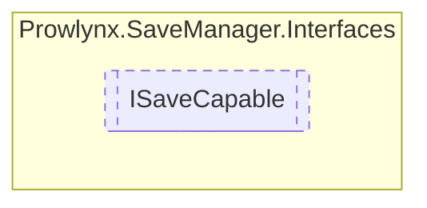

# ISaveCapable `Public interface`

## Description
Represents a class that features save capable data. 
            This is often a MonoBehavior class.

## Diagram


## Members
### Properties
#### Public  properties
| Type | Name | Methods |
| --- | --- | --- |
| `Type` | [`SaveDataType`](#savedatatype)<br>The main root type that inherits from [BaseSaveData](../models/BaseSaveData.md) . <br>            This is necessary to successfully deserialize the data.<br>            Use typeof(ClassThatInheritsFromBaseSaveData) to quickly implement this. | `get` |

### Methods
#### Public  methods
| Returns | Name |
| --- | --- |
| [`BaseSaveData`](../models/BaseSaveData.md) | [`GetSaveData`](#getsavedata)()<br>Called by the save manager and should return any data you wish to save in a single class of the type defined in [ISaveCapable](prowlynx/savemanager/interfaces/ISaveCapable.md).[SaveDataType](#savedatatype) . |
| `string` | [`GetSaveKey`](#getsavekey)()<br>A unique save key for the data. This must be unique across your project. |
| `void` | [`LoadSaveData`](#loadsavedata)([`BaseSaveData`](../models/BaseSaveData.md) saveData, `bool` saveDataFound)<br>Called by the save manager when data is provided by a [ISaveStorageTarget](./ISaveStorageTarget.md) for the [ISaveCapable](prowlynx/savemanager/interfaces/ISaveCapable.md) . <br>            Implementations of this should assume the first param is of type [ISaveCapable](prowlynx/savemanager/interfaces/ISaveCapable.md).[SaveDataType](#savedatatype) and cast accordingly. |
| `void` | [`OnLoadFailed`](#onloadfailed)([`ManagerStatus`](../models/ManagerStatus.md) status)<br>When data loading for this particular [ISaveCapable](prowlynx/savemanager/interfaces/ISaveCapable.md) has failed, this method is called. |
| `void` | [`OnSaveFailed`](#onsavefailed)(`Exception` e)<br>When saving has failed for this save capable the exception is provided to the save capable for logging/popup purposes. <br>            Be mindful that saving is generally called when the application quits so there may not be time to display a popup. |

## Details
### Summary
Represents a class that features save capable data. 
            This is often a MonoBehavior class.

### Methods
#### GetSaveKey
```csharp
public string GetSaveKey()
```
##### Summary
A unique save key for the data. This must be unique across your project.

##### Returns
Unique save key

#### GetSaveData
```csharp
public BaseSaveData GetSaveData()
```
##### Summary
Called by the save manager and should return any data you wish to save in a single class of the type defined in [ISaveCapable](prowlynx/savemanager/interfaces/ISaveCapable.md).[SaveDataType](#savedatatype) .

##### Returns
Data to save internally to a [ISaveStorageTarget](./ISaveStorageTarget.md)

#### LoadSaveData
```csharp
public void LoadSaveData(BaseSaveData saveData, bool saveDataFound)
```
##### Arguments
| Type | Name | Description |
| --- | --- | --- |
| [`BaseSaveData`](../models/BaseSaveData.md) | saveData | The save data found, this is a [ISaveCapable](prowlynx/savemanager/interfaces/ISaveCapable.md).[SaveDataType](#savedatatype) , cast it appropriately. |
| `bool` | saveDataFound | Whether there was any data found. If there was none you might like to assume this is a new player. |

##### Summary
Called by the save manager when data is provided by a [ISaveStorageTarget](./ISaveStorageTarget.md) for the [ISaveCapable](prowlynx/savemanager/interfaces/ISaveCapable.md) . 
            Implementations of this should assume the first param is of type [ISaveCapable](prowlynx/savemanager/interfaces/ISaveCapable.md).[SaveDataType](#savedatatype) and cast accordingly.

#### OnLoadFailed
```csharp
public void OnLoadFailed(ManagerStatus status)
```
##### Arguments
| Type | Name | Description |
| --- | --- | --- |
| [`ManagerStatus`](../models/ManagerStatus.md) | status | The reason why it failed. |

##### Summary
When data loading for this particular [ISaveCapable](prowlynx/savemanager/interfaces/ISaveCapable.md) has failed, this method is called.

#### OnSaveFailed
```csharp
public void OnSaveFailed(Exception e)
```
##### Arguments
| Type | Name | Description |
| --- | --- | --- |
| `Exception` | e |  |

##### Summary
When saving has failed for this save capable the exception is provided to the save capable for logging/popup purposes. 
            Be mindful that saving is generally called when the application quits so there may not be time to display a popup.

### Properties
#### SaveDataType
```csharp
public Type SaveDataType { get; }
```
##### Summary
The main root type that inherits from [BaseSaveData](../models/BaseSaveData.md) . 
            This is necessary to successfully deserialize the data.
            Use typeof(ClassThatInheritsFromBaseSaveData) to quickly implement this.

*Generated with* [*ModularDoc*](https://github.com/hailstorm75/ModularDoc)
