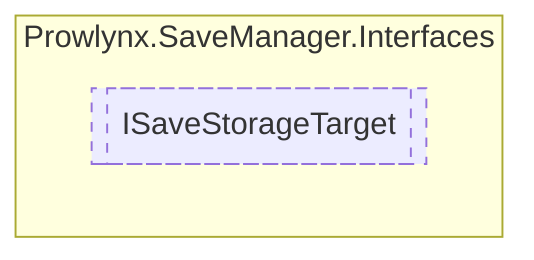

# ISaveStorageTarget `Public interface`

## Description
A save storage target (Unity Cloud Save, local storage...)

## Diagram


## Members
### Properties
#### Public  properties
| Type | Name | Methods |
| --- | --- | --- |
| [`StorageBackingType`](../models/StorageBackingType.md) | [`BackingType`](#backingtype)<br>Storage type is important for conflict resolution. | `get` |
| `string` | [`Id`](#id)<br>The ID of the storage: Unity Cloud Save or Local Save Binary for example. | `get` |

### Methods
#### Public  methods
| Returns | Name |
| --- | --- |
| `UniTask`&lt;(`bool` Item1, `Dictionary`&lt;`string`, `string`&gt; Item2)&gt; | [`LoadAll`](#loadall)()<br>Provide all data from the storage. This will later be taken and stored in memory. Do not worry about persistence. |
| `UniTask`&lt;`bool`&gt; | [`SaveAll`](#saveall)(`Dictionary`&lt;`string`, `string`&gt; data) |

## Details
### Summary
A save storage target (Unity Cloud Save, local storage...)

### Methods
#### SaveAll
```csharp
public UniTask<bool> SaveAll(Dictionary<string, string> data)
```
##### Arguments
| Type | Name | Description |
| --- | --- | --- |
| `Dictionary`&lt;`string`, `string`&gt; | data |   |

#### LoadAll
```csharp
public UniTask<Tuple<bool,Dictionary>> LoadAll()
```
##### Summary
Provide all data from the storage. This will later be taken and stored in memory. Do not worry about persistence.

##### Returns
Success and the data to load into memory

### Properties
#### Id
```csharp
public string Id { get; }
```
##### Summary
The ID of the storage: Unity Cloud Save or Local Save Binary for example.

#### BackingType
```csharp
public StorageBackingType BackingType { get; }
```
##### Summary
Storage type is important for conflict resolution.

*Generated with* [*ModularDoc*](https://github.com/hailstorm75/ModularDoc)
