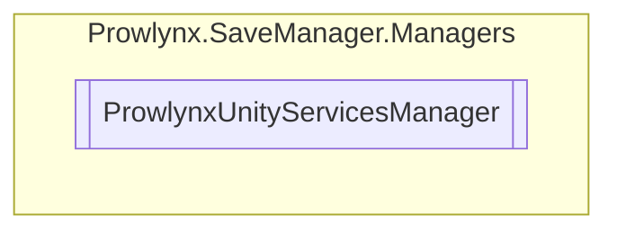

# ProwlynxUnityServicesManager `Public class`

## Diagram


## Members
### Methods
#### Public Static methods
| Returns | Name |
| --- | --- |
| `UniTask` | [`InitializeUnityServices`](#initializeunityservices)() |

#### Private Static methods
| Returns | Name |
| --- | --- |
| `void` | [`SetupEvents`](#setupevents)() |

## Details
### Constructors
#### ProwlynxUnityServicesManager [1/2]
[*Source code*](https://github.com///blob//:/Projects/Unity/Prowlynx Save Manager/ProwlynxSaveManagerReleaser/Assets/Prowlynx/SaveManager/Managers/ProwlynxUnityServicesManager.cs#L23)
```csharp
private static ProwlynxUnityServicesManager()
```

#### ProwlynxUnityServicesManager [2/2]
```csharp
public ProwlynxUnityServicesManager()
```

### Methods
#### InitializeUnityServices
[*Source code*](https://github.com///blob//:/Projects/Unity/Prowlynx Save Manager/ProwlynxSaveManagerReleaser/Assets/Prowlynx/SaveManager/Managers/ProwlynxUnityServicesManager.cs#L23)
```csharp
public static async UniTask InitializeUnityServices()
```

#### SetupEvents
[*Source code*](https://github.com///blob//:/Projects/Unity/Prowlynx Save Manager/ProwlynxSaveManagerReleaser/Assets/Prowlynx/SaveManager/Managers/ProwlynxUnityServicesManager.cs#L23)
```csharp
private static void SetupEvents()
```

*Generated with* [*ModularDoc*](https://github.com/hailstorm75/ModularDoc)
