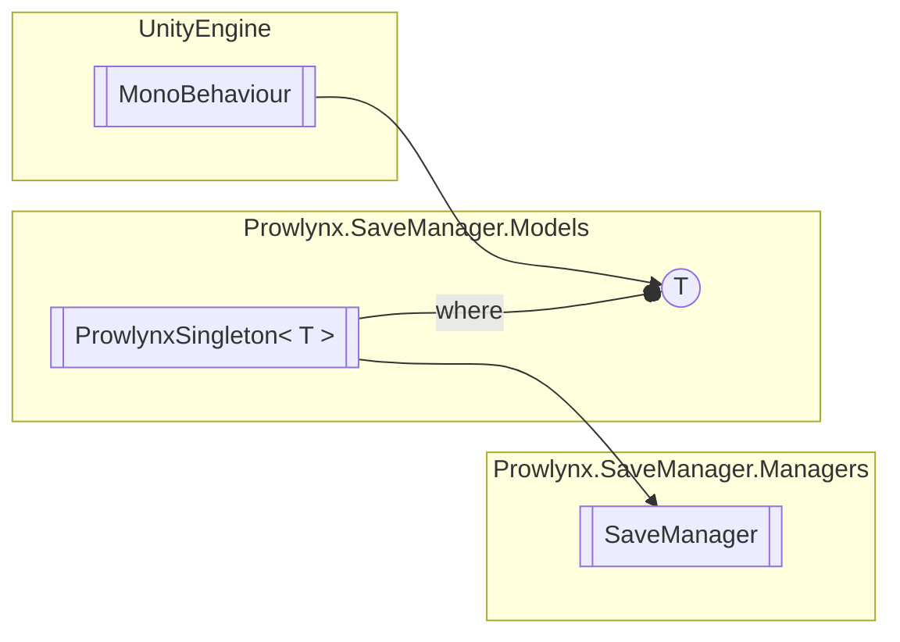

# SaveManager `Public class`

## Description
An example of a save manager that most use cases will work with.

## Diagram


## Members
### Methods
#### Private  methods
| Returns | Name |
| --- | --- |
| `UniTaskVoid` | [`<Start>b__31_0`](#startb310)() |
| `void` | [`Awake`](#awake)() |
| `UniTaskVoid` | [`InitializeAutoSaveManager`](#initializeautosavemanager)()<br>Initializes and loads for the first time from the perspective of the auto save manager.<br>            Assumes Unity Cloud and such has been initialized. |
| `UniTask`&lt;`bool`&gt; | [`LoadDataFromStorage`](#loaddatafromstorage)(`Func`&lt;[`ISaveStorageTarget`](../interfaces/ISaveStorageTarget.md), `bool`&gt; storageSelector, [`StorageBackingType`](../models/StorageBackingType.md) preferredStorageForConflict) |
| `UniTask` | [`LoadDataToSaveCapables`](#loaddatatosavecapables)()<br>Call the GetValue method and give the results if successful to the save capable. <br>            Handles failures by passing them to the save capable. |
| `void` | [`OnApplicationQuit`](#onapplicationquit)() |
| `UniTaskVoid` | [`RepeatSaveCloud`](#repeatsavecloud)() |
| `UniTaskVoid` | [`RepeatSaveLocal`](#repeatsavelocal)() |
| `bool` | [`SanityCheck`](#sanitycheck)()<br>Confirms whether the Unity Cloud Save is being used and if so, whether it has initialized successfully. |
| `UniTask`&lt;`bool`&gt; | [`SaveDataFromCapables`](#savedatafromcapables)(`bool` saveToSaveStorage, `Func`&lt;[`ISaveStorageTarget`](../interfaces/ISaveStorageTarget.md), `bool`&gt; storageSelector) |
| `UniTask`&lt;(`bool` Item1, [`ISaveStorageTarget`](../interfaces/ISaveStorageTarget.md) Item2)&gt; | [`SaveDataToStorage`](#savedatatostorage)(`Func`&lt;[`ISaveStorageTarget`](../interfaces/ISaveStorageTarget.md), `bool`&gt; storageSelector) |
| `IEnumerator` | [`Start`](#start)() |

#### Public  methods
| Returns | Name |
| --- | --- |
| `UniTask`&lt;([`ManagerStatus`](../models/ManagerStatus.md) Item1, `object` Item2)&gt; | [`GetValue`](#getvalue)(`Type` saveDataClass, `string` key)<br>Manually get a saved value from memory. <br>            Advanced users only! |
| `void` | [`LoadAllFromStorage`](#loadallfromstorage)()<br>Load all save capables. This allows advanced users to custom time their implementation.<br>            Make sure [SaveManager](prowlynx/savemanager/managers/SaveManager.md).doNotAutoLoadOrSave is set to true before using. [SaveManager](prowlynx/savemanager/managers/SaveManager.md)._saveStorages must be populated and and [SaveManager](prowlynx/savemanager/managers/SaveManager.md)._storageSelector must be set through [SaveManager](prowlynx/savemanager/managers/SaveManager.md).AddCustomSaveStorageTarget(System.Collections.Generic.IEnumerable{Prowlynx.SaveManager.Interfaces.ISaveStorageTarget},System.Func{Prowlynx.SaveManager.Interfaces.ISaveStorageTarget,System.Boolean}) .<br>            Additionally [SaveManager](prowlynx/savemanager/managers/SaveManager.md).preferredStorageTypeForConflicts must be set. |
| `UniTask` | [`LoadAllFromStorageAsync`](#loadallfromstorageasync)()<br>Load all save capables. This allows advanced users to custom time their implementation.<br>            Make sure [SaveManager](prowlynx/savemanager/managers/SaveManager.md).doNotAutoLoadOrSave is set to true before using. [SaveManager](prowlynx/savemanager/managers/SaveManager.md)._saveStorages must be populated and and [SaveManager](prowlynx/savemanager/managers/SaveManager.md)._storageSelector must be set through [SaveManager](prowlynx/savemanager/managers/SaveManager.md).AddCustomSaveStorageTarget(System.Collections.Generic.IEnumerable{Prowlynx.SaveManager.Interfaces.ISaveStorageTarget},System.Func{Prowlynx.SaveManager.Interfaces.ISaveStorageTarget,System.Boolean}) .<br>            Additionally [SaveManager](prowlynx/savemanager/managers/SaveManager.md).preferredStorageTypeForConflicts must be set. |
| `void` | [`RegisterSaveCapable`](#registersavecapable)([`ISaveCapable`](../interfaces/ISaveCapable.md) saveCapable)<br>Register save capable class, this must be only called when [SaveManager](prowlynx/savemanager/managers/SaveManager.md).OnReadyForSaveCapableRegistration is fired. |
| `UniTask`&lt;[`ManagerStatus`](../models/ManagerStatus.md)&gt; | [`Save`](#save)([`ISaveCapable`](../interfaces/ISaveCapable.md) saveCapable, `string` value)<br>Manually save a single item for a single key. This should be used when you wish to "push" a save instead of wait for saves. <br>            Advanced users only! |
| `void` | [`SaveAllToStorage`](#savealltostorage)()<br>Save all save capables. This allows advanced users to custom time their implementation.<br>            Make sure [SaveManager](prowlynx/savemanager/managers/SaveManager.md).doNotAutoLoadOrSave is set to true before using. [SaveManager](prowlynx/savemanager/managers/SaveManager.md)._saveStorages must be populated and [SaveManager](prowlynx/savemanager/managers/SaveManager.md)._storageSelector must be set through [SaveManager](prowlynx/savemanager/managers/SaveManager.md).AddCustomSaveStorageTarget(System.Collections.Generic.IEnumerable{Prowlynx.SaveManager.Interfaces.ISaveStorageTarget},System.Func{Prowlynx.SaveManager.Interfaces.ISaveStorageTarget,System.Boolean}) . |
| `UniTask`&lt;`bool`&gt; | [`SaveAllToStorageAsync`](#savealltostorageasync)()<br>Save all save capables. This allows advanced users to custom time their implementation.<br>            Make sure [SaveManager](prowlynx/savemanager/managers/SaveManager.md).doNotAutoLoadOrSave is set to true before using. [SaveManager](prowlynx/savemanager/managers/SaveManager.md)._saveStorages must be populated and [SaveManager](prowlynx/savemanager/managers/SaveManager.md)._storageSelector must be set through [SaveManager](prowlynx/savemanager/managers/SaveManager.md).AddCustomSaveStorageTarget(System.Collections.Generic.IEnumerable{Prowlynx.SaveManager.Interfaces.ISaveStorageTarget},System.Func{Prowlynx.SaveManager.Interfaces.ISaveStorageTarget,System.Boolean}) |
| `bool` | [`SaveDataFromCapable`](#savedatafromcapable)([`ISaveCapable`](../interfaces/ISaveCapable.md) saveCapable)<br>Save a single save capable to memory. Use this instead of Save&lt;T&gt;(ISaveCapable, T) Will issue a call to your "OnSaveFailed" if there is an exception. |

#### Public Static methods
| Returns | Name |
| --- | --- |
| `void` | [`AddCustomSaveStorageTarget`](#addcustomsavestoragetarget-12)(`...`) |

## Details
### Summary
An example of a save manager that most use cases will work with.

### Inheritance
 - [`ProwlynxSingleton`](../models/ProwlynxSingletonT.md)&lt;[`SaveManager`](prowlynx/savemanager/managers/SaveManager.md)&gt;

### Nested types
#### Classes
 - `StateEventData`

### Constructors
#### SaveManager [1/2]
[*Source code*](https://github.com///blob//:/Projects/Unity/Prowlynx Save Manager/ProwlynxSaveManagerReleaser/Assets/Prowlynx/SaveManager/Managers/SaveManager.cs#L118)
```csharp
private static SaveManager()
```

#### SaveManager [2/2]
```csharp
public SaveManager()
```

### Methods
#### Awake
[*Source code*](https://github.com///blob//:/Projects/Unity/Prowlynx Save Manager/ProwlynxSaveManagerReleaser/Assets/Prowlynx/SaveManager/Managers/SaveManager.cs#L118)
```csharp
private void Awake()
```

#### Start
[*Source code*](https://github.com///blob//:/Projects/Unity/Prowlynx Save Manager/ProwlynxSaveManagerReleaser/Assets/Prowlynx/SaveManager/Managers/SaveManager.cs#L118)
```csharp
private IEnumerator Start()
```

#### OnApplicationQuit
[*Source code*](https://github.com///blob//:/Projects/Unity/Prowlynx Save Manager/ProwlynxSaveManagerReleaser/Assets/Prowlynx/SaveManager/Managers/SaveManager.cs#L118)
```csharp
private async void OnApplicationQuit()
```

#### RepeatSaveCloud
[*Source code*](https://github.com///blob//:/Projects/Unity/Prowlynx Save Manager/ProwlynxSaveManagerReleaser/Assets/Prowlynx/SaveManager/Managers/SaveManager.cs#L118)
```csharp
private async UniTaskVoid RepeatSaveCloud()
```

#### RepeatSaveLocal
[*Source code*](https://github.com///blob//:/Projects/Unity/Prowlynx Save Manager/ProwlynxSaveManagerReleaser/Assets/Prowlynx/SaveManager/Managers/SaveManager.cs#L118)
```csharp
private async UniTaskVoid RepeatSaveLocal()
```

#### InitializeAutoSaveManager
[*Source code*](https://github.com///blob//:/Projects/Unity/Prowlynx Save Manager/ProwlynxSaveManagerReleaser/Assets/Prowlynx/SaveManager/Managers/SaveManager.cs#L118)
```csharp
private async UniTaskVoid InitializeAutoSaveManager()
```
##### Summary
Initializes and loads for the first time from the perspective of the auto save manager.
            Assumes Unity Cloud and such has been initialized.

##### Returns


#### LoadDataToSaveCapables
[*Source code*](https://github.com///blob//:/Projects/Unity/Prowlynx Save Manager/ProwlynxSaveManagerReleaser/Assets/Prowlynx/SaveManager/Managers/SaveManager.cs#L118)
```csharp
private async UniTask LoadDataToSaveCapables()
```
##### Summary
Call the GetValue method and give the results if successful to the save capable. 
            Handles failures by passing them to the save capable.

##### Returns


#### SaveDataFromCapables
[*Source code*](https://github.com///blob//:/Projects/Unity/Prowlynx Save Manager/ProwlynxSaveManagerReleaser/Assets/Prowlynx/SaveManager/Managers/SaveManager.cs#L118)
```csharp
private async UniTask<bool> SaveDataFromCapables(bool saveToSaveStorage, Func<ISaveStorageTarget, bool> storageSelector)
```
##### Arguments
| Type | Name | Description |
| --- | --- | --- |
| `bool` | saveToSaveStorage |   |
| `Func`&lt;[`ISaveStorageTarget`](../interfaces/ISaveStorageTarget.md), `bool`&gt; | storageSelector |   |

#### SanityCheck
[*Source code*](https://github.com///blob//:/Projects/Unity/Prowlynx Save Manager/ProwlynxSaveManagerReleaser/Assets/Prowlynx/SaveManager/Managers/SaveManager.cs#L118)
```csharp
private bool SanityCheck()
```
##### Summary
Confirms whether the Unity Cloud Save is being used and if so, whether it has initialized successfully.

##### Returns


#### SaveDataToStorage
[*Source code*](https://github.com///blob//:/Projects/Unity/Prowlynx Save Manager/ProwlynxSaveManagerReleaser/Assets/Prowlynx/SaveManager/Managers/SaveManager.cs#L118)
```csharp
private async UniTask<Tuple<bool,ISaveStorageTarget>> SaveDataToStorage(Func<ISaveStorageTarget, bool> storageSelector)
```
##### Arguments
| Type | Name | Description |
| --- | --- | --- |
| `Func`&lt;[`ISaveStorageTarget`](../interfaces/ISaveStorageTarget.md), `bool`&gt; | storageSelector |   |

#### LoadDataFromStorage
[*Source code*](https://github.com///blob//:/Projects/Unity/Prowlynx Save Manager/ProwlynxSaveManagerReleaser/Assets/Prowlynx/SaveManager/Managers/SaveManager.cs#L118)
```csharp
private async UniTask<bool> LoadDataFromStorage(Func<ISaveStorageTarget, bool> storageSelector, StorageBackingType preferredStorageForConflict)
```
##### Arguments
| Type | Name | Description |
| --- | --- | --- |
| `Func`&lt;[`ISaveStorageTarget`](../interfaces/ISaveStorageTarget.md), `bool`&gt; | storageSelector |   |
| [`StorageBackingType`](../models/StorageBackingType.md) | preferredStorageForConflict |   |

#### RegisterSaveCapable
[*Source code*](https://github.com///blob//:/Projects/Unity/Prowlynx Save Manager/ProwlynxSaveManagerReleaser/Assets/Prowlynx/SaveManager/Managers/SaveManager.cs#L118)
```csharp
public void RegisterSaveCapable(ISaveCapable saveCapable)
```
##### Arguments
| Type | Name | Description |
| --- | --- | --- |
| [`ISaveCapable`](../interfaces/ISaveCapable.md) | saveCapable | The save capable class |

##### Summary
Register save capable class, this must be only called when [SaveManager](prowlynx/savemanager/managers/SaveManager.md).OnReadyForSaveCapableRegistration is fired.

#### SaveDataFromCapable
[*Source code*](https://github.com///blob//:/Projects/Unity/Prowlynx Save Manager/ProwlynxSaveManagerReleaser/Assets/Prowlynx/SaveManager/Managers/SaveManager.cs#L118)
```csharp
public bool SaveDataFromCapable(ISaveCapable saveCapable)
```
##### Arguments
| Type | Name | Description |
| --- | --- | --- |
| [`ISaveCapable`](../interfaces/ISaveCapable.md) | saveCapable | The save capable to save |

##### Summary
Save a single save capable to memory. Use this instead of Save&lt;T&gt;(ISaveCapable, T) Will issue a call to your "OnSaveFailed" if there is an exception.

##### Returns


#### Save
[*Source code*](https://github.com///blob//:/Projects/Unity/Prowlynx Save Manager/ProwlynxSaveManagerReleaser/Assets/Prowlynx/SaveManager/Managers/SaveManager.cs#L118)
```csharp
public async UniTask<ManagerStatus> Save(ISaveCapable saveCapable, string value)
```
##### Arguments
| Type | Name | Description |
| --- | --- | --- |
| [`ISaveCapable`](../interfaces/ISaveCapable.md) | saveCapable | This save capable item that will supply us with the key (GetSaveKey() is called) |
| `string` | value | The value that is BaseSaveData inherited |

##### Summary
Manually save a single item for a single key. This should be used when you wish to "push" a save instead of wait for saves. 
            Advanced users only!

##### Returns
Success, cloud init error or save manager error

#### GetValue
[*Source code*](https://github.com///blob//:/Projects/Unity/Prowlynx Save Manager/ProwlynxSaveManagerReleaser/Assets/Prowlynx/SaveManager/Managers/SaveManager.cs#L118)
```csharp
public async UniTask<Tuple<ManagerStatus,object>> GetValue(Type saveDataClass, string key)
```
##### Arguments
| Type | Name | Description |
| --- | --- | --- |
| `Type` | saveDataClass | The save data class that inherits from BaseSaveData (not called or used in any way) |
| `string` | key | The key to get (generally GetKeyData()) |

##### Summary
Manually get a saved value from memory. 
            Advanced users only!

##### Returns
Just decompile this method if you want to know...

#### AddCustomSaveStorageTarget [1/2]
[*Source code*](https://github.com///blob//:/Projects/Unity/Prowlynx Save Manager/ProwlynxSaveManagerReleaser/Assets/Prowlynx/SaveManager/Managers/SaveManager.cs#L118)
```csharp
public static void AddCustomSaveStorageTarget(ISaveStorageTarget target, Func<ISaveStorageTarget, bool> saveStorageSelector)
```
##### Arguments
| Type | Name | Description |
| --- | --- | --- |
| [`ISaveStorageTarget`](../interfaces/ISaveStorageTarget.md) | target |   |
| `Func`&lt;[`ISaveStorageTarget`](../interfaces/ISaveStorageTarget.md), `bool`&gt; | saveStorageSelector |   |

#### AddCustomSaveStorageTarget [2/2]
[*Source code*](https://github.com///blob//:/Projects/Unity/Prowlynx Save Manager/ProwlynxSaveManagerReleaser/Assets/Prowlynx/SaveManager/Managers/SaveManager.cs#L118)
```csharp
public static void AddCustomSaveStorageTarget(IEnumerable<ISaveStorageTarget> targets, Func<ISaveStorageTarget, bool> saveStorageSelector)
```
##### Arguments
| Type | Name | Description |
| --- | --- | --- |
| `IEnumerable`&lt;[`ISaveStorageTarget`](../interfaces/ISaveStorageTarget.md)&gt; | targets |   |
| `Func`&lt;[`ISaveStorageTarget`](../interfaces/ISaveStorageTarget.md), `bool`&gt; | saveStorageSelector |   |

#### LoadAllFromStorage
[*Source code*](https://github.com///blob//:/Projects/Unity/Prowlynx Save Manager/ProwlynxSaveManagerReleaser/Assets/Prowlynx/SaveManager/Managers/SaveManager.cs#L118)
```csharp
public void LoadAllFromStorage()
```
##### Summary
Load all save capables. This allows advanced users to custom time their implementation.
            Make sure [SaveManager](prowlynx/savemanager/managers/SaveManager.md).doNotAutoLoadOrSave is set to true before using. [SaveManager](prowlynx/savemanager/managers/SaveManager.md)._saveStorages must be populated and and [SaveManager](prowlynx/savemanager/managers/SaveManager.md)._storageSelector must be set through [SaveManager](prowlynx/savemanager/managers/SaveManager.md).AddCustomSaveStorageTarget(System.Collections.Generic.IEnumerable{Prowlynx.SaveManager.Interfaces.ISaveStorageTarget},System.Func{Prowlynx.SaveManager.Interfaces.ISaveStorageTarget,System.Boolean}) .
            Additionally [SaveManager](prowlynx/savemanager/managers/SaveManager.md).preferredStorageTypeForConflicts must be set.

#### LoadAllFromStorageAsync
[*Source code*](https://github.com///blob//:/Projects/Unity/Prowlynx Save Manager/ProwlynxSaveManagerReleaser/Assets/Prowlynx/SaveManager/Managers/SaveManager.cs#L118)
```csharp
public async UniTask LoadAllFromStorageAsync()
```
##### Summary
Load all save capables. This allows advanced users to custom time their implementation.
            Make sure [SaveManager](prowlynx/savemanager/managers/SaveManager.md).doNotAutoLoadOrSave is set to true before using. [SaveManager](prowlynx/savemanager/managers/SaveManager.md)._saveStorages must be populated and and [SaveManager](prowlynx/savemanager/managers/SaveManager.md)._storageSelector must be set through [SaveManager](prowlynx/savemanager/managers/SaveManager.md).AddCustomSaveStorageTarget(System.Collections.Generic.IEnumerable{Prowlynx.SaveManager.Interfaces.ISaveStorageTarget},System.Func{Prowlynx.SaveManager.Interfaces.ISaveStorageTarget,System.Boolean}) .
            Additionally [SaveManager](prowlynx/savemanager/managers/SaveManager.md).preferredStorageTypeForConflicts must be set.

#### SaveAllToStorage
[*Source code*](https://github.com///blob//:/Projects/Unity/Prowlynx Save Manager/ProwlynxSaveManagerReleaser/Assets/Prowlynx/SaveManager/Managers/SaveManager.cs#L118)
```csharp
public void SaveAllToStorage()
```
##### Summary
Save all save capables. This allows advanced users to custom time their implementation.
            Make sure [SaveManager](prowlynx/savemanager/managers/SaveManager.md).doNotAutoLoadOrSave is set to true before using. [SaveManager](prowlynx/savemanager/managers/SaveManager.md)._saveStorages must be populated and [SaveManager](prowlynx/savemanager/managers/SaveManager.md)._storageSelector must be set through [SaveManager](prowlynx/savemanager/managers/SaveManager.md).AddCustomSaveStorageTarget(System.Collections.Generic.IEnumerable{Prowlynx.SaveManager.Interfaces.ISaveStorageTarget},System.Func{Prowlynx.SaveManager.Interfaces.ISaveStorageTarget,System.Boolean}) .

#### SaveAllToStorageAsync
[*Source code*](https://github.com///blob//:/Projects/Unity/Prowlynx Save Manager/ProwlynxSaveManagerReleaser/Assets/Prowlynx/SaveManager/Managers/SaveManager.cs#L118)
```csharp
public async UniTask<bool> SaveAllToStorageAsync()
```
##### Summary
Save all save capables. This allows advanced users to custom time their implementation.
            Make sure [SaveManager](prowlynx/savemanager/managers/SaveManager.md).doNotAutoLoadOrSave is set to true before using. [SaveManager](prowlynx/savemanager/managers/SaveManager.md)._saveStorages must be populated and [SaveManager](prowlynx/savemanager/managers/SaveManager.md)._storageSelector must be set through [SaveManager](prowlynx/savemanager/managers/SaveManager.md).AddCustomSaveStorageTarget(System.Collections.Generic.IEnumerable{Prowlynx.SaveManager.Interfaces.ISaveStorageTarget},System.Func{Prowlynx.SaveManager.Interfaces.ISaveStorageTarget,System.Boolean})

#### <Start>b__31_0
[*Source code*](https://github.com///blob//:/Projects/Unity/Prowlynx Save Manager/ProwlynxSaveManagerReleaser/Assets/Prowlynx/SaveManager/Managers/SaveManager.cs#L118)
```csharp
private async UniTaskVoid <Start>b__31_0()
```

*Generated with* [*ModularDoc*](https://github.com/hailstorm75/ModularDoc)
