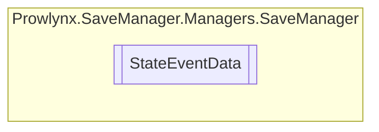

# StateEventData `Public class`

## Description
Represents data that was given to the event.

## Diagram


## Details
### Summary
Represents data that was given to the event.

### Constructors
#### StateEventData
```csharp
public StateEventData()
```

*Generated with* [*ModularDoc*](https://github.com/hailstorm75/ModularDoc)
