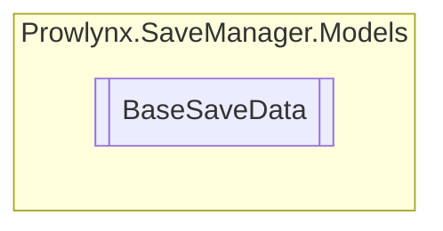

# BaseSaveData `Public class`

## Description
All save data classes must inherit from this.

## Diagram


## Details
### Summary
All save data classes must inherit from this.

### Constructors
#### BaseSaveData
```csharp
public BaseSaveData()
```

*Generated with* [*ModularDoc*](https://github.com/hailstorm75/ModularDoc)
