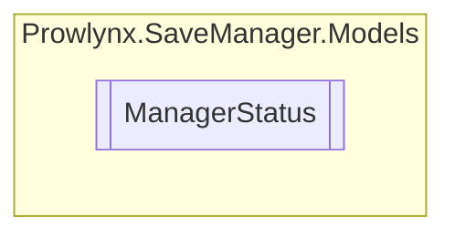

# ManagerStatus `Public enum`

## Diagram

## Details
### Fields
#### SUCCESS

#### SAVE_MANAGER_DATA_NOT_LOADED

#### SAVE_MANAGER_CLOUD_INIT_ERROR

#### SAVE_MANAGER_SAVE_ERROR

#### SAVE_MANAGER_LOAD_CLOUD_ERROR

#### SAVE_MANAGER_LOAD_KEY_NOT_FOUND

#### SAVE_MANAGER_LOAD_GET_VALUE_ERROR

*Generated with* [*ModularDoc*](https://github.com/hailstorm75/ModularDoc)
