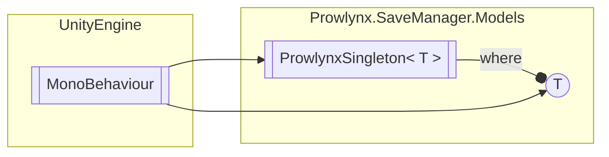

# ProwlynxSingleton&lt;T&gt; `Public class`

## Description
Generic Singleton

## Diagram


## Members
### Properties
#### Public Static properties
| Type | Name | Methods |
| --- | --- | --- |
| `T` | [`Instance`](#instance)<br>The instance property | `get` |

### Methods
#### Public  methods
| Returns | Name |
| --- | --- |
| `void` | [`Awake`](#awake)()<br>Cast this to the instance |

## Details
### Summary
Generic Singleton

### Generic types
| Type | Description | Constraints |
| --- | --- | --- |
| `T` | The type for the Singleton | `MonoBehaviour` |

### Inheritance
 - `MonoBehaviour`

### Constructors
#### ProwlynxSingleton
```csharp
public ProwlynxSingleton()
```

### Methods
#### Awake
[*Source code*](https://github.com///blob//:/Projects/Unity/Prowlynx Save Manager/ProwlynxSaveManagerReleaser/Assets/Prowlynx/SaveManager/Models/ProwlynxSingleton.cs#L19)
```csharp
public void Awake()
```
##### Summary
Cast this to the instance

### Properties
#### Instance
```csharp
public static T Instance { get; }
```
##### Summary
The instance property

*Generated with* [*ModularDoc*](https://github.com/hailstorm75/ModularDoc)
