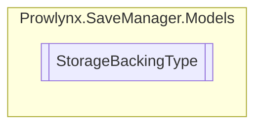

# StorageBackingType `Public enum`

## Diagram

```mermaid
  flowchart LR
  classDef interfaceStyle stroke-dasharray: 5 5;
  classDef abstractStyle stroke-width:4px
  subgraph Prowlynx.SaveManager.Models
  Prowlynx.SaveManager.Models.StorageBackingType[[StorageBackingType]]
  end
```

## Details
### Fields
#### Local

#### Remote

#### Other

*Generated with* [*ModularDoc*](https://github.com/hailstorm75/ModularDoc)
