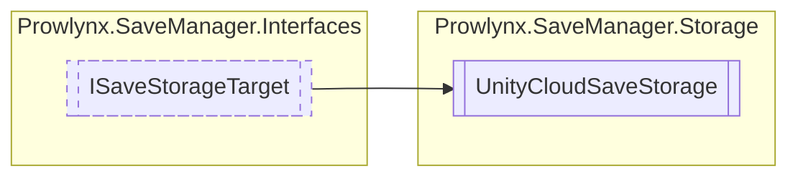

# UnityCloudSaveStorage `Public class`

## Diagram


## Members
### Properties
#### Public  properties
| Type | Name | Methods |
| --- | --- | --- |
| [`StorageBackingType`](../models/StorageBackingType.md) | [`BackingType`](#backingtype) | `get` |
| `string` | [`Id`](#id) | `get` |

### Methods
#### Public  methods
| Returns | Name |
| --- | --- |
| `UniTask`&lt;(`bool` Item1, `Dictionary`&lt;`string`, `string`&gt; Item2)&gt; | [`LoadAll`](#loadall)() |
| `UniTask`&lt;`bool`&gt; | [`SaveAll`](#saveall)(`Dictionary`&lt;`string`, `string`&gt; data) |

## Details
### Inheritance
 - [
`ISaveStorageTarget`
](../interfaces/ISaveStorageTarget.md)

### Constructors
#### UnityCloudSaveStorage [1/2]
```csharp
public UnityCloudSaveStorage()
```

#### UnityCloudSaveStorage [2/2]
[*Source code*](https://github.com///blob//:/Projects/Unity/Prowlynx Save Manager/ProwlynxSaveManagerReleaser/Assets/Prowlynx/SaveManager/Storage/UnityCloudSaveStorage.cs#L15)
```csharp
private static UnityCloudSaveStorage()
```

### Methods
#### LoadAll
[*Source code*](https://github.com///blob//:/Projects/Unity/Prowlynx Save Manager/ProwlynxSaveManagerReleaser/Assets/Prowlynx/SaveManager/Storage/UnityCloudSaveStorage.cs#L15)
```csharp
public virtual async UniTask<Tuple<bool,Dictionary>> LoadAll()
```

#### SaveAll
[*Source code*](https://github.com///blob//:/Projects/Unity/Prowlynx Save Manager/ProwlynxSaveManagerReleaser/Assets/Prowlynx/SaveManager/Storage/UnityCloudSaveStorage.cs#L15)
```csharp
public virtual async UniTask<bool> SaveAll(Dictionary<string, string> data)
```
##### Arguments
| Type | Name | Description |
| --- | --- | --- |
| `Dictionary`&lt;`string`, `string`&gt; | data |   |

### Properties
#### Id
```csharp
public virtual string Id { get; }
```

#### BackingType
```csharp
public virtual StorageBackingType BackingType { get; }
```

*Generated with* [*ModularDoc*](https://github.com/hailstorm75/ModularDoc)
